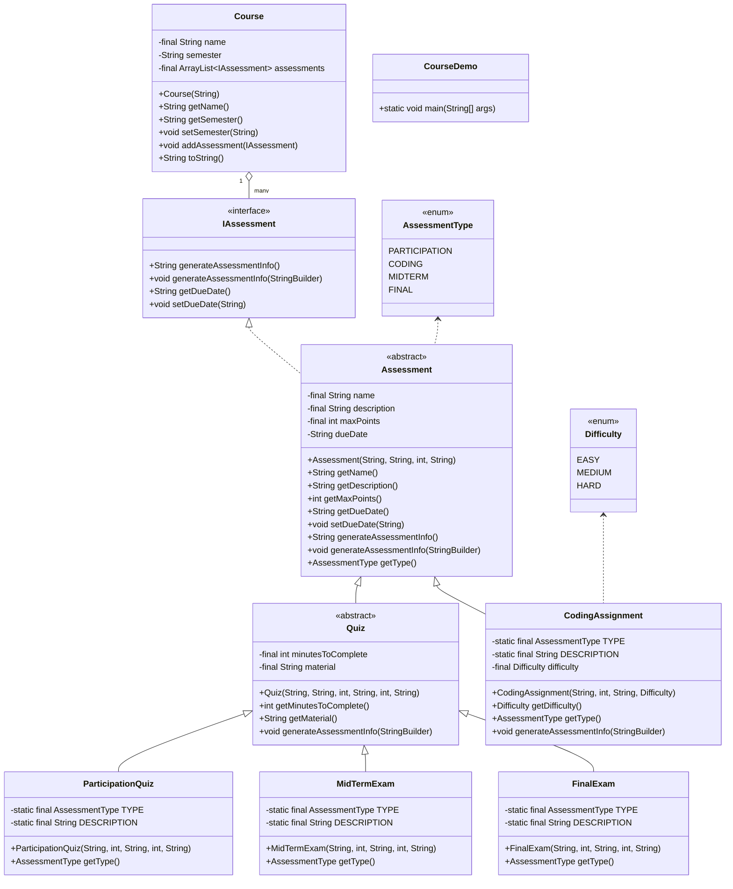

# COSC 2436 Assignment 3

Java implementation of the college course assessment hierarchy described in
`COSC2436_Assignment3.pdf`.

## Files

- `IAssessment.java`: interface for assessment info and due dates
- `Assessment.java`: abstract base class
- `Quiz.java`: abstract quiz subclass
- `ParticipationQuiz.java`, `MidTermExam.java`, `FinalExam.java`: quiz types
- `CodingAssignment.java`: coding assignment type
- `AssessmentType.java`, `AssignmentDifficulty.java`: enums
- `Course.java`: course container
- `CourseDemo.java`: demo with `main`

## Build and Run

```bash
javac CourseDemo.java
java CourseDemo
```

## Mermaid Class Diagram

